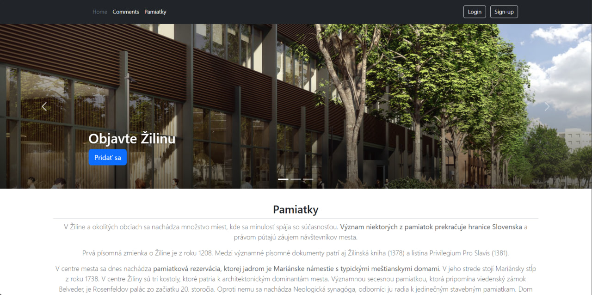
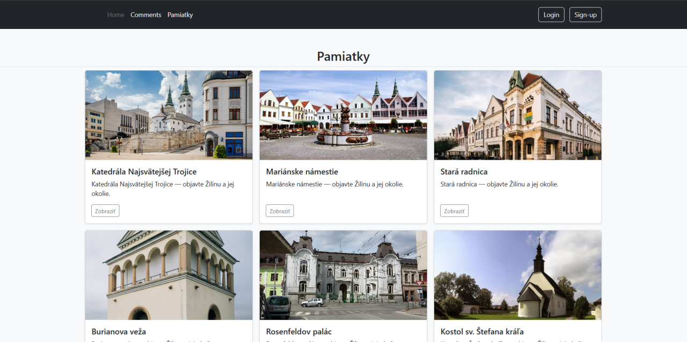
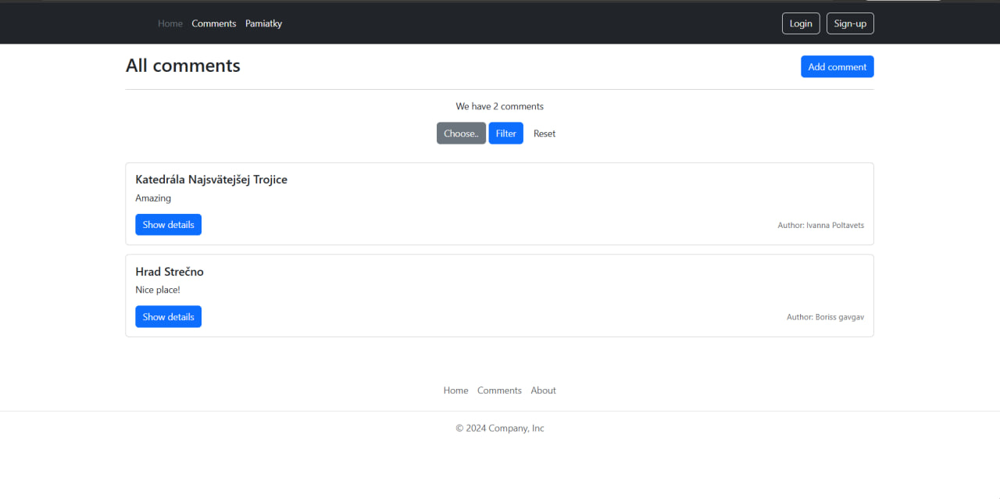
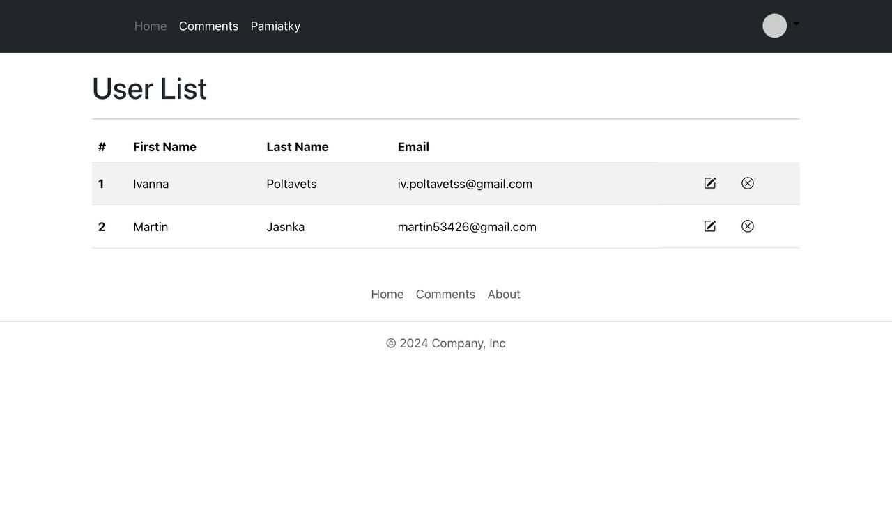

# Žilina City Guide

A full-stack web application for discovering places in Žilina, with authentication, comments, filtering, user roles and an admin panel.

**Live demo:** https://zilina-city-guide.onrender.com/

## Screenshots

### Home


### Places


### Comments


### Admin Panel


## Features

- User registration and login
- Session-based authentication
- User and administrator roles
- Browsing and filtering places
- Comments and user interaction
- Admin user management
- File attachment support
- MySQL database integration
- Persistent database-backed sessions

## Tech Stack

**Backend:** Node.js · Express  
**Frontend:** EJS · JavaScript · CSS  
**Database:** MySQL  
**Authentication:** express-session · bcrypt  
**Other:** multer · express-mysql-session

## Run Locally

Clone the repository:

```bash
git clone https://github.com/quttaj/zilina-city-guide.git
cd zilina-city-guide
```

Install dependencies:

```bash
npm install
```

Create a `.env` file based on `.env.example` and configure your MySQL connection.

Initialize the database:

```bash
npm run db:setup
```

Start the development server:

```bash
npm run dev
```

The app will be available at:

```text
http://localhost:3000
```

## Testing

```bash
npm test
```

## Deployment

The application is deployed on Render with an external MySQL database.
